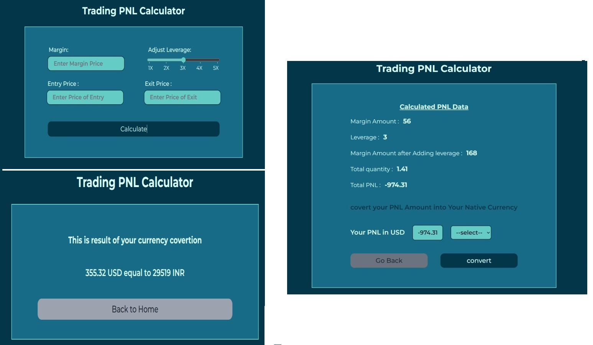

## PNL - Calculator

## Table of Contents
- [Project Title](#project-title)
- [Description](#description)
- [Demo](#demo)
- [Internship](#internship)
- [Technologies Used](#technologies-used)
- [Acknowledgments](#acknowledgments)
## Description
[PNL calculator is help to calculate your trading profit and losses easily to enter values to the given required filed and finally got full detailed reviews of your entered data is correct or not  and also this project is helpful to convert your PNL USD to native country currency like such as i.e : INR,JPY,AUD, GBP and Etc..]
## Demo
[Live preview](https://kishorekumar-kp.github.io/cyberdude-challenges/javaScript-dom/08-PNL-calculator/dist/)

## Internship
This internship is provided by [CyberDude Networks Pvt. Ltd.](https://youtube.com/cyberdudenetworks) as part of the 6-Month Free Internship program, a skill development initiative organized to enhance participants' skills. Mentoring was provided by [Mr. Anbuselvan Rocky](https://instagram.com/anbuselvanrocky). For more information, [you can contact CyberDude Networks here](https://cyberdudenetworks.com).

## Technologies Used 

<ol>
<li>HTML</li>
<li>TailwindCSS</li>
<li>Javascript</li>
<li>Vite</li>
<li>API</li>
</ol>

## Acknowledgments

Thanks to 
[just-validate](https://just-validate.dev/),
[Currency API](https://www.frankfurter.app/docs/)

---

Reach me to LinkedIn **https://www.linkedin.com/in/kishorekumar-kp/** 
