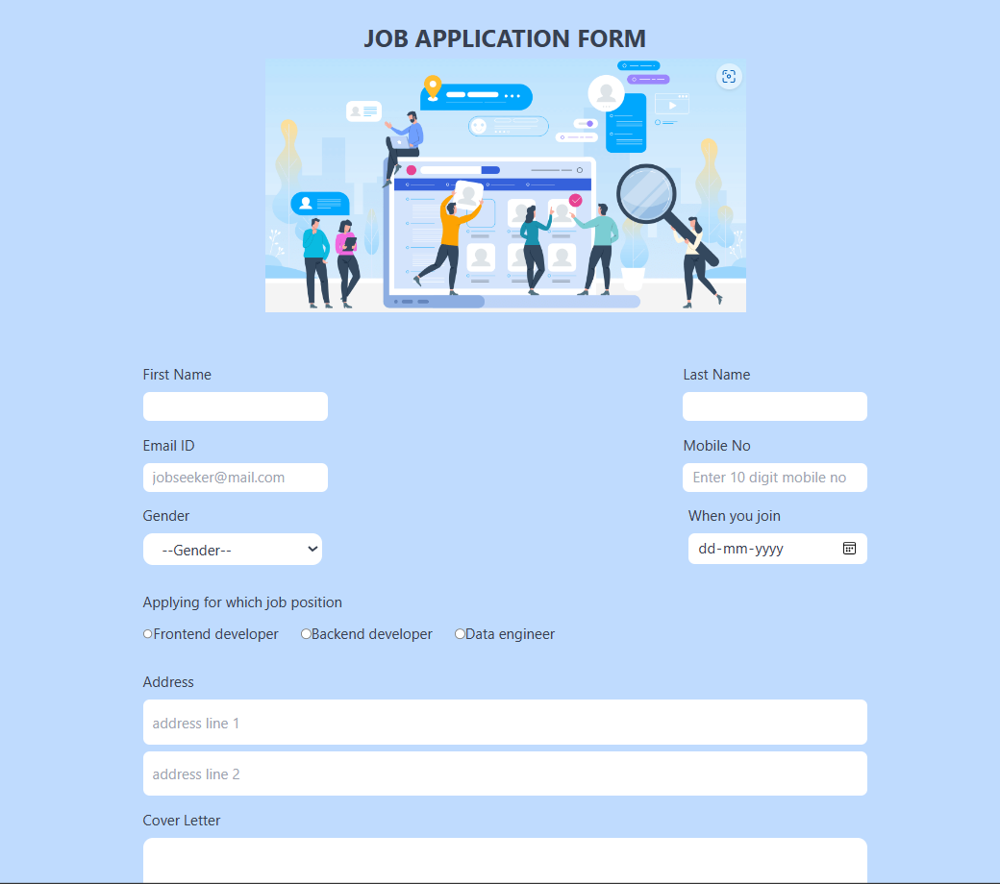

# Project Title 
[form -get data from user]
## Table of Contents
- [Project Title](#project-title)
- [Description](#description)
- [Demo](#demo)
- [Internship](#internship)
- [Technologies Used](#technologies-used)
- [Acknowledgments](#acknowledgments)
## Description
[Form validation task is build by using tailwindcss and vite configured project . its is doing collecting  form data from users and display to the separate section of UI, its easy to check the entered data is correct or not]
## Demo
[Live preview](https://kishorekumar-kp.github.io/cyberdude-challenges/javaScript-dom/Task-01/dist/)

## Internship
This internship is provided by [CyberDude Networks Pvt. Ltd.](https://youtube.com/cyberdudenetworks) as part of the 6-Month Free Internship program, a skill development initiative organized to enhance participants' skills. Mentoring was provided by [Mr. Anbuselvan Rocky](https://instagram.com/anbuselvanrocky). For more information, [you can contact CyberDude Networks here](https://cyberdudenetworks.com).
## Technologies Used 
<ol>
<li>HTML</li>
<li>TailwindCSS</li>
</ol>

## Acknowledgments

Thanks to 
[khaja sherif](https://github.com/sharif-22)
[vasanthkumar](https://github.com/Vk2401)

---

Reach me to LinkedIn **https://www.linkedin.com/in/kishorekumar-kp/** 
