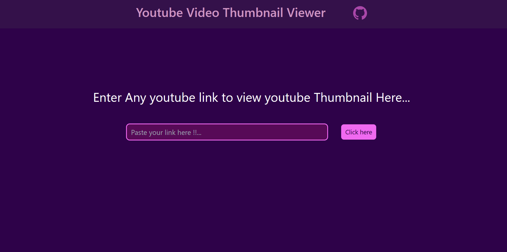

#   Youtube thumbnail viewer
## Table of Contents
- [Project Title](#project-title)
- [Description](#description)
- [Demo](#demo)
- [Internship](#internship)
- [Technologies Used](#technologies-used)
## Description
[Youtube thumbnail viewer application is used to user can view any youtube video thumbnail from simply pasting those url from youtube.]
## Demo
[Live preview](https://kishorekumar-kp.github.io/cyberdude-challenges/javaScript-dom/youtube-thumbnail-viewer/dist/)

## Internship
This internship is provided by [CyberDude Networks Pvt. Ltd.](https://youtube.com/cyberdudenetworks) as part of the 6-Month Free Internship program, a skill development initiative organized to enhance participants' skills. Mentoring was provided by [Mr. Anbuselvan Rocky](https://instagram.com/anbuselvanrocky). For more information, [you can contact CyberDude Networks here](https://cyberdudenetworks.com).

## Technologies Used 

<ol>
<li>HTML</li>
<li>TailwindCSS</li>
<li>Javascript</li>
<li>Vite</li>
</ol>

---

Reach me to LinkedIn **https://www.linkedin.com/in/kishorekumar-kp/** 
